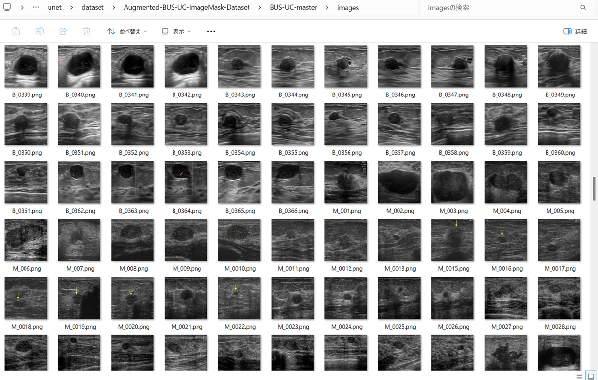
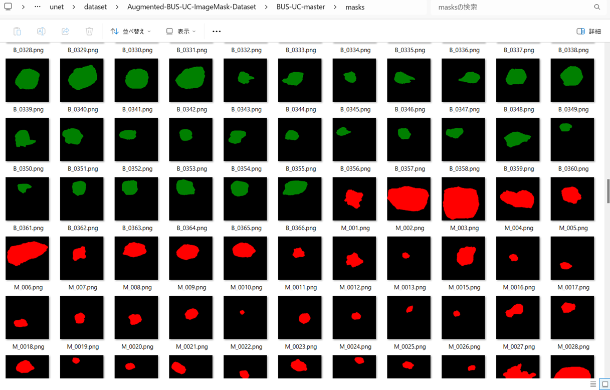

<h2>Augmented-BUS-UC-ImageMask-Dataset (2025/05/17)</h2>

This is a 512x512 pixels Augmented Benign and Malignant ImageMask Dataset derived by us from 
<a href="https://data.mendeley.com/datasets/3ksd7w7jkx/1">
Mendeley Data: BUS_UC</a>
 

 
<b>Download our dataset</b> 
You can download our dataset from the google drive 
<a href="https://drive.google.com/file/d/1ObyZhN7up0Crhxsi5dkcu9oUo_zVQCL3/view?usp=sharing">
Augemented-BUS-UC-ImageMask-Data.zip</a>
 

<h3>1. Dataset Citation</h3>
We used the following dataset in Mendeley web site 
<a href="https://data.mendeley.com/datasets/3ksd7w7jkx/1">
Mendeley Data: BUS_UC</a>
  

<b>Description</b> 
The BUS_UC dataset includes 358 benign tumor images and 453 malignant tumor images. 
The resolution of Ultrasound images is 256 × 256 pixels. 
All these images were obtained from the website Ultrasound Cases (ultrasoundcases.info),
 which does not provide ground truth images. 
 Therefore, with the help of an experienced radiologist, benign and malignant tumor images are annotated 
 for segmentation and classification task.
 
 
<b>Citation </b> 
If you use this dataset, please cite : 

Ahmed Iqbal, Muhammad Sharif,  
"Memory-efficient transformer network with feature fusion for breast tumor segmentation and classification task
",  
Engineering Applications of Artificial Intelligence, 2023.  

<b>Institutions</b> 
COMSATS Institute of Information Technology - Wah Campus
  
<b>Categories</b> 
Breast Cancer, Image Segmentation, Ultrasound, Image Classification
  
<b>License</b> 
<a href="https://creativecommons.org/licenses/by/4.0/deed.en">
CC BY 4.0
</a>
 

<h3>2. ImageMaskDataset Generation</h3>
<h3>2.1 Download BUS_UC dataset</h3>

If you would like to generate this Augmented dataset by yourself,
please download the master dataset from 
<a href="https://data.mendeley.com/datasets/3ksd7w7jkx/1">
Mendeley Data: BUS_UC</a>
 
 

<h3>2.2 Generate colored mask files</h3>
  The BUS_UC dataset includes 2 types of images and masks data, Benign and Malignant,
  but those mask files are all white-black image.
Therefore, we created green and red colored mask files from masks in Benign and Malignant dataset.
by using Python script <a href="./MaskColorizer.py">MaskColorizer.py</a> 

<pre>
python MaskColorizer.py
</pre>
This command generates BUS-UC-master dataset from the original Benign and Malignant datasets 
<pre>
./BUS-UC-master
├─images
└─masks
</pre>

 
<b>BUS-UC-master mages sample</b> 
 
 
<b>BUS-UC-master masks sample</b> 
 
 

The number of images and mask files in BUS-UC-master is 811 respectively, and not enough to use a training set of 
a segmentation model.
Therefore, to increase of the number of the dataset, we used an offilne augmention tool <a href="./ImageMaskDatasetGenerator.py">
ImageMaskDataGenerator,py</a>
to augment BUS-UC-master dataset, The tool supports the following data augmentation methods. 
<li>hfip</li>
<li>vflip</li>
<li>rotation</li>
<li>shrinking</li>
<li>deformation</li>
<li>distortion</li>
<li>barrel_distortion</li>
<li>pincussion_distortion</li>
 

<h3>2.3 Split master</h3>

Please run the following command for Python <a href="./split_augmented_master.py">split_augmented__master.py</a> 
 
<pre>
>python split_augmented_master.py
</pre>
This splits Augmented-BUS-UC-master into test, train and valid subdatasets. 
<pre>
./Augmented-BUS-UC-ImageMask-Dataset
├─test
│  ├─images
│  └─masks
├─train
│  ├─images
│  └─masks
└─valid
    ├─images
    └─masks
</pre>

Train images sample 
  
Train mask sample 
  

Dataset Statistics  
 
